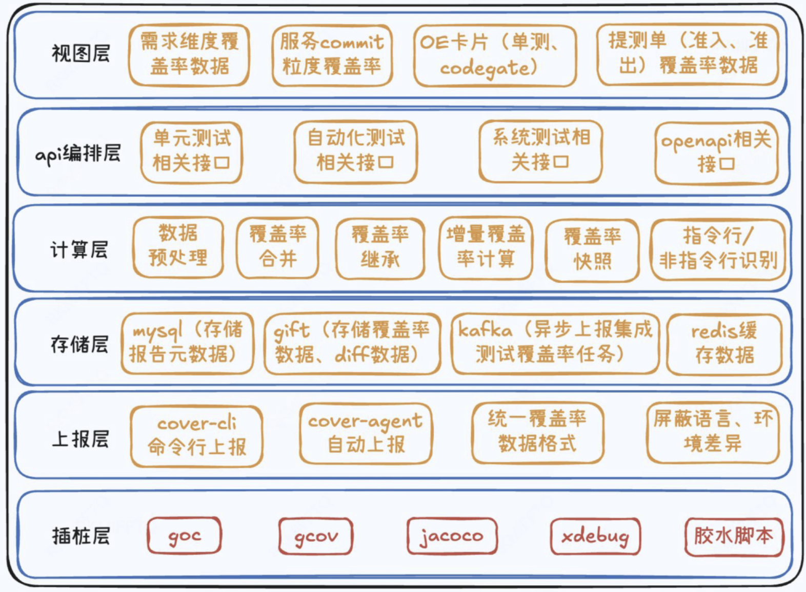
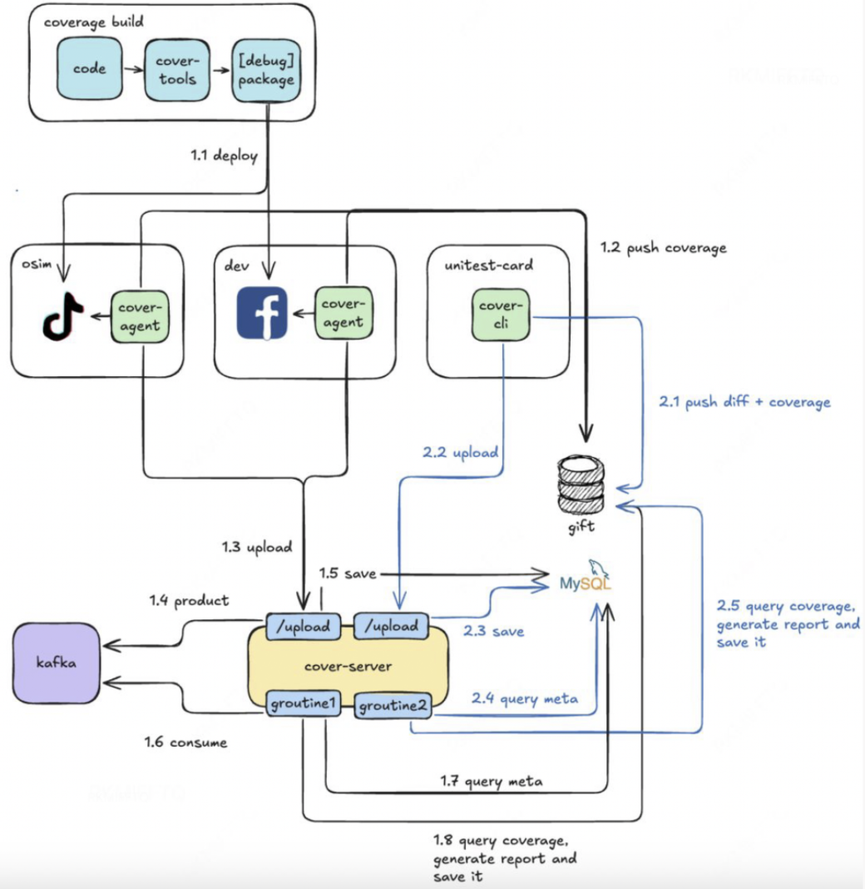
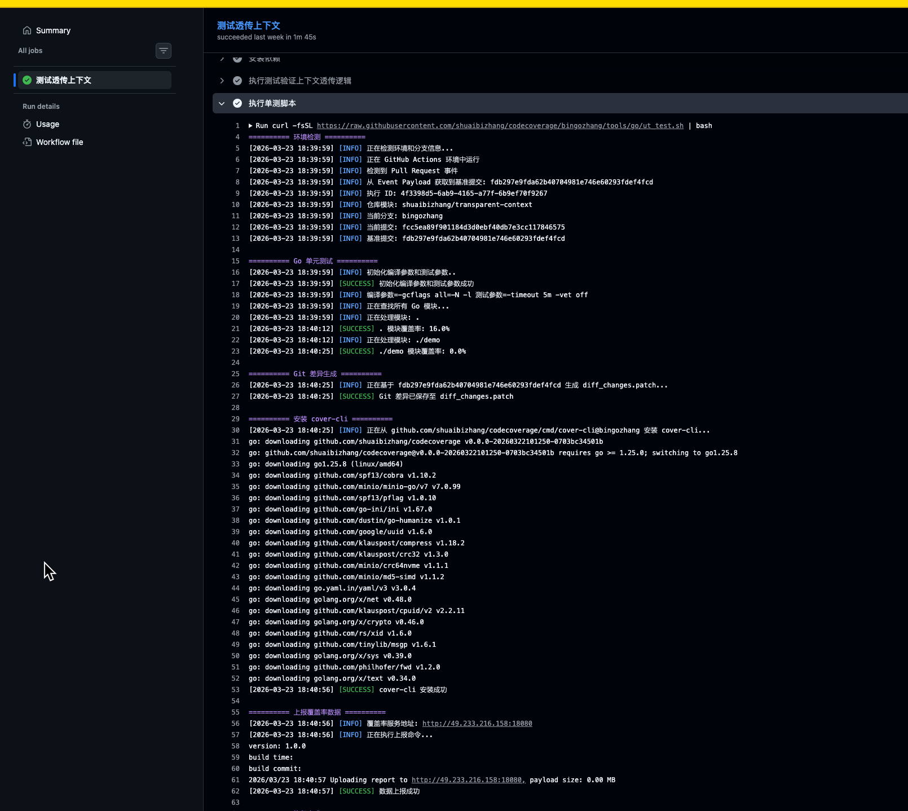
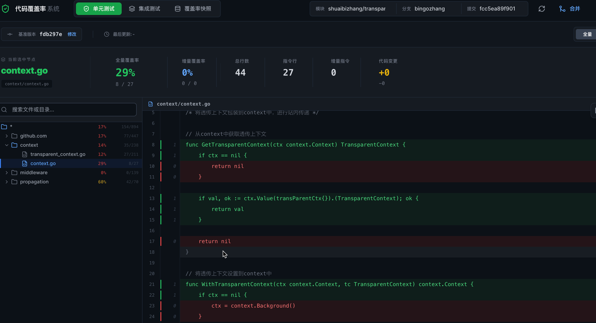
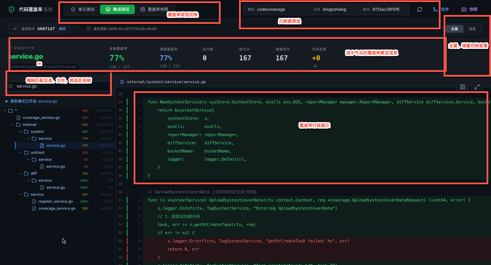
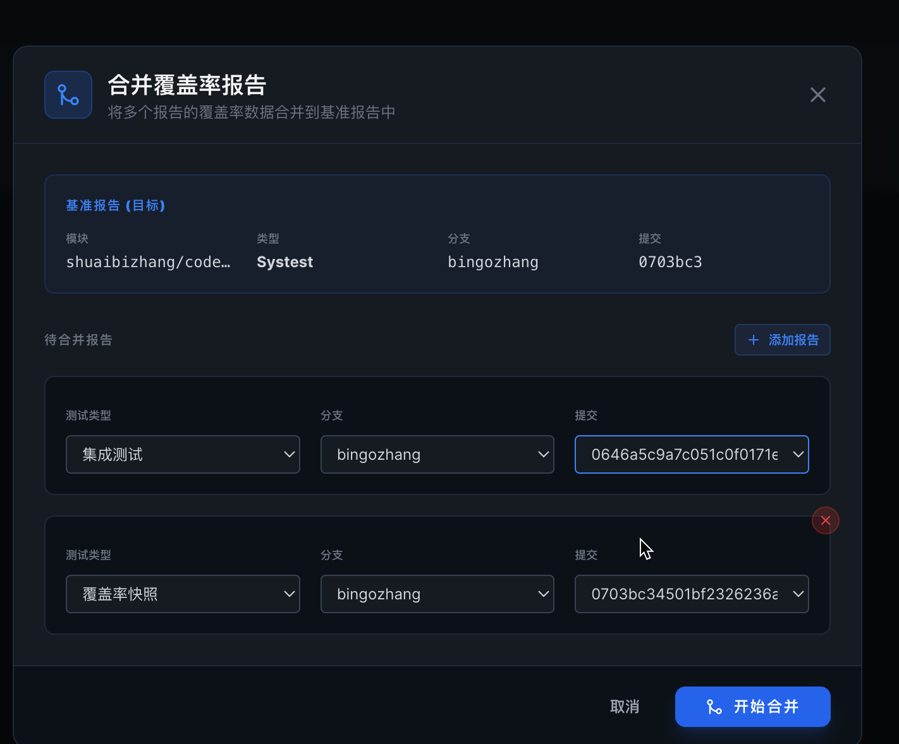
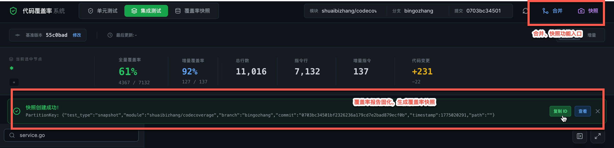

# CodeCoverage - 跨语言代码覆盖率度量与质量门禁工具

## 项目背景

在业务推动“测试左移”建设的过程中，需要通过 CI 强制卡点和质量门禁设置来提升代码质量。研测团队急需一款能够屏蔽底层语言差异、清晰展示“已覆盖/未覆盖”明细的覆盖率度量工具，以便针对性地优化测试用例。

由于现有工具难以同时满足 **“测试左移卡点”** 与 **“跨语言精准覆盖率度量”** 的核心诉求，设计并开发了这款 `codecoverage` 工具。

## 核心目标

- **统一采集与度量**：实现跨语言覆盖率数据的标准化采集，屏蔽不同语言的技术栈差异。
- **CI 质量门禁**：支持在 CI 流程中设置增量或全量覆盖率卡点，确保代码质量不回退。
- **精准明细展示**：提供行级的代码覆盖率报告，辅助开发与测试人员精准定位未覆盖代码。
- **支持决策优化**：通过覆盖率数据驱动测试用例的补充与优化。

---

## 系统架构

### 1. 水平分层架构

系统采用分层设计，各层职责明确：

- **视图层 (View Layer)**：
  - 展示覆盖率数据（可视化报表）。
  - CI 卡点 Job 快照展示。
- **API 编排层 (API Orchestration Layer)**：
  - 封装核心业务逻辑，为视图层提供高效的数据接口。
- **计算层 (Calculation Layer)**：
  - **报告生成**：根据归一化数据，生成支持高性能查询的覆盖率报告。
  - **灵活计算**：支持增量/全量覆盖率、指令行/非指令行计算。
  - **报告合并**：支持同源（相同代码源）或异源（不同代码源）报告的无缝合并。
  - **快照管理**：卡点时生成固化快照，提供可溯源的历史报告。
- **采集上报层 (Collection & Reporting Layer)**：
  - **数据归一化**：定义标准覆盖率数据格式，屏蔽语言差异。
  - **自动化上报**：提供 `cover-cli` 和 `cover-agent` 组件，将数据异步上报至 OSS 并触发计算任务。

### 2. 垂直组件架构

核心组件及其职责：

- **cover-cli**: 适用于一次性任务（Short-lived Jobs），如单元测试流程。
- **cover-agent**: 适用于常驻服务（Long-running Services），如 Web 服务、微服务的定时采集。
- **cover-server**: 核心计算引擎，负责处理归一化数据并生成高性能报告。

---

## 接入指南

### 单元测试接入

在 CI 流程中引入 `codecoverage` Action，即可自动完成覆盖率数据的上报与分析。

---

## 功能展示

### 1. 基础功能
- **行级展示**：支持代码覆盖率的行级可视化，已覆盖与未覆盖一目了然。
- **多维度查询**：支持按模块、分支、Commit、BaseCommit 等维度查询增量及全量数据。
- **灵活搜索**：支持节点模糊匹配，快速定位特定文件的覆盖率。

### 2. 快照与合并
- **报告合并**：支持不同类型、不同 Commit 之间的覆盖率报告合并，全方位评估测试效果。
  
- **数据快照**：支持对当前 Commit 的最新覆盖率数据进行“快照”固化，方便后续审计与质量追溯。
  